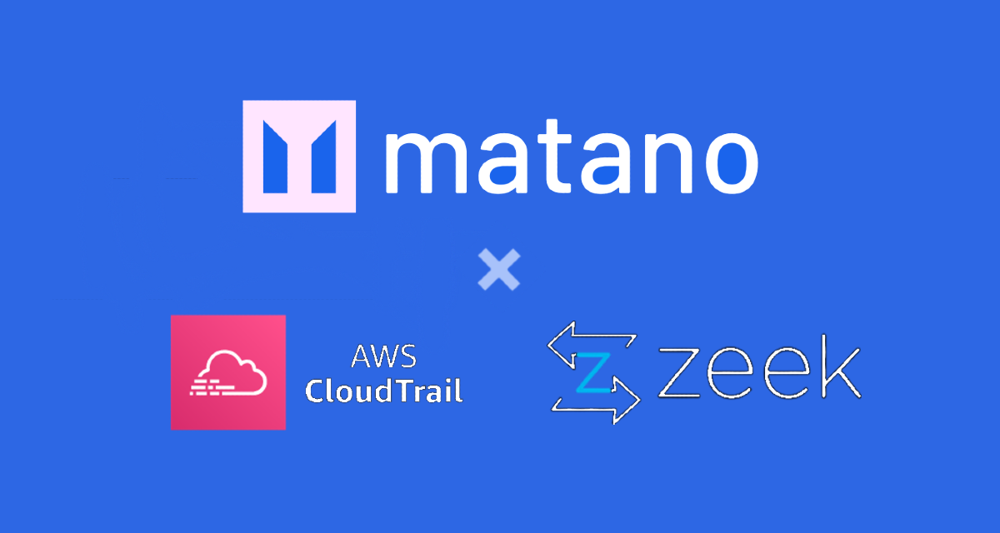

<head>
  <meta name="twitter:card" content="summary_large_image" />
  <meta name="twitter:creator" content="@AhmedSamrose" />
</head>

We're adding support for the first two managed log sources to Matano: AWS CloudTrail and Zeek. Now you can analyze your AWS events and network traffic in Matano without having to define any schemas or parsers.

<!-- truncate -->



## What's new

We want to make analyzing all your data in Matano as easy as possible. Managed log sources in Matano come with predefined parsers, schemas, and configurations that make ingesting logs as easy as a few lines of configuration. Now, we're launching managed log source support for two popular log sources: AWS CloudTrail and Zeek.

AWS CloudTrail lets you analyze all the API activity in your AWS accounts. Zeek is a popular open source framework for analyzing network traffic metadata that covers many different protocols and generates rich logs for downstream analysis.

As of today, Matano supports ingesting all your AWS CloudTrail data (both control plane and data plane) and the Zeek managed log source handles 43 different Zeek logs.

## How it works

### CloudTrail

Let's walk through how to ingest CloudTrail logs into Matano. Assume we have a trail already set up delivering CloudTrail logs to an S3 bucket. We can simply point Matano at that bucket and start ingesting logs, with a simple configuration file:

```yml
# log_source.yml
name: aws_cloudtrail

managed:
  type: "AWS_CLOUDTRAIL"

ingest:
  s3_source:
    bucket_name: "my-bucket"
    key_prefix: "my/key/prefix"
```

Deploying Matano with this configuration will create a Matano table named `aws_cloudtrail` that you can query and write realtime detections on.

The schema is fully normalized to ECS so we easily do queries like searching on related ips or checking if an event is a failure, without getting into CloudTrail specific fields.

Here's an example Athena query where we check for the latest events with an access denied error:

```sql
select event.action, event.provider,
  aws.cloudtrail.error_code, aws.cloudtrail.error_message,
  source.ip
from matano.aws_cloudtrail
where ts > current_timestamp - interval '7' day
and aws.cloudtrail.error_code = 'AccessDenied'
```

We can also write Python detections that will run on realtime on our CloudTrail events. Here is an example that detects a failed attempt to export an EC2 volume:

```python
def detect(record):
  return (
    record.deepget("event.provider") == "ec2.amazonaws.com"
    and record.deepget("event.action") == "CreateInstanceExportTask"
    and event.get("outcome") == "failure"
  )
```

### Zeek

Let's also see how we can ingest Zeek logs into Matano. Say we are ingesting Zeek DNS log files from an S3 bucket. We would create a log source configuration like so:

```yml
# log_source.yml
name: zeek

managed:
  type: "ZEEK"

ingest:
  s3_source:
    bucket_name: "my-bucket"
    key_prefix: "my/key/prefix"
```

We then create a table configuration table to create a Zeek DNS file:

```yml
# tables/dns.yml
name: dns
```

If we want to ingest other Zeek logs, its as simple as adding a table file. For example, if we want to also ingest Zeek HTTP logs, we can add a file like so. We can also extend the schema and add additional fields if we need.

```yml
# tables/http.yml
name: http

schema:
  - name: zeek
    type:
      type: struct
      fields:
        - name: custom_field
          type: string
```

Once we deploy Matano, Apache Iceberg tables will be created for each Zeek log we specify. We can then query the tables using Athena. Here's a sample SQL query looking at on Zeek DNS data.

```sql
SELECT
  answer.data as ans,
  avg(answer.ttl) as ttl
FROM
  matano.zeek_dns
  cross join unnest(dns.answers) as t(answer)
GROUP BY
  answer.data
LIMIT 5;
```

We can also write realtime detections on our Zeek logs. Here's a sample detection that detects when a Windows service has been changed or started with svcctl remotely:

```python
IP_ALLOWLIST = [
  "229.292.0.0",
]

def detect(record):
  return (
    record.deepget("zeek.dce_rpc.endpoint") == "svcctl"
    and (
        record.deepget("zeek.dce_rpc.operation") in (
            "ChangeServiceConfigW",
            "StartServiceA"
        )
    )
    and record.deepget("source.ip") not in IP_ALLOWLIST
  )
```

## Getting started

You can start using the CloudTrail and Zeek managed log sources today. Follow the [steps](/docs/getting-started) to get started and take a look at the [CloudTrail](/docs/log-sources/managed/aws/aws-cloudtrail) and [Zeek](/docs/log-sources/managed/zeek) documentation.
