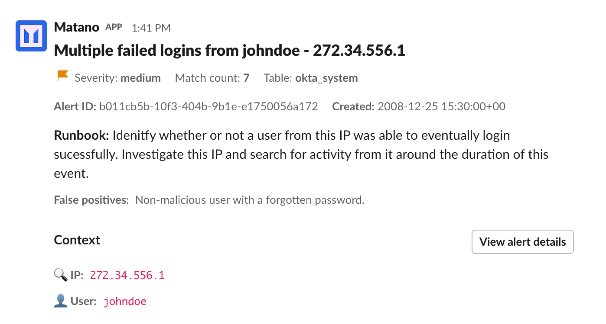

import Tabs from '@theme/Tabs';
import TabItem from '@theme/TabItem';
import MatanoSquareLogo from '../../../src/assets/matano_square.png';

### Example



### How to setup a Slack alert destination in Matano

#### 1) Create the alert destination configuration file

```
my-matano-directory
└── integrations
    └── destinations
        └── slack_my_team.yml
```

##### slack_my_team.yml

```yml
name: slack_my_team # A name for your destination.

type: SLACK
properties:
  channel: <MY_CHANNEL_ID_OR_NAME> # e.g. C04AG3QSXSS or my-alerts
  client_id: <MY_CLIENT_ID> # Client ID for Slack App
```

**Note**: Dont worry about filling these parameters yet, that will be part of a later step.

### 2) Creating a Slack App for Matano Alerts

1) **[Login to Slack](https://slack.com/signin)** using an admin account. 

2) Under the **"[Your Apps](https://slack.com/signin)"** page in Slack click **"Create New App"**. 

3) When prompted with the **"Create an app"** dialog, select the option **"From an app manifest"**

4) Under **"Pick a workspace to develop your app"**, choose the Slack Workspace in which you would like to install the Matano Alerts Bot.

5) **Click "Next"**, and when prompted with the **"Enter the app manifest"** dialog, **paste the following as YAML**:

```yml
display_information:
  name: Matano
  description: Open source security lake platform for AWS
  background_color: "#2d67e4"
features:
  bot_user:
    display_name: Matano
    always_online: false
oauth_config:
  scopes:
    bot:
      - channels:history
      - chat:write
      - chat:write.customize
      - users:read
      - users:read.email
      - groups:history
settings:
  org_deploy_enabled: false
  socket_mode_enabled: false
  token_rotation_enabled: false
```

6) **Click "Next"**

7) When prompted with **"Review summary & create your app"** dialog, **click "Create"**.

> **Note:** If you aren't a Slack administrator, follow these additional steps.
- On the **"Basic Information"** page, click **"Request to Install"**.
- Ask your Slack administrator to approve the install request, but do not install it yet. Once approved, the **Request Submitted** button will update to **Install to Workspace**. Continue

### 3: Installing the Matano Alerts Slack Bot

If your [Slack plan](https://app.slack.com/plans) is Enterprise Grid, please see the Enterprise Grid tab below. For all other Slack plans, please see the Default Slack tab below.

<Tabs
  defaultValue="slack"
  values={[
    {label: 'Default', value: 'slack'},
    {label: 'Enterprise Grid', value: 'slack-enterprise'},
  ]}>
  <TabItem value="slack">


### Slack Bot - Install to your Workspace

1) On the **"Basic Information"** page in Slack click **"Install to Workspace"**. 

2) Click **Allow** to authorize access to your new Matano Slack app, once redirected to the OAuth authorization page.


  </TabItem>
  <TabItem value="slack-enterprise">


### Slack Bot - Install to Enterprise Grid

1) On the **"Settings > Basic Information"** page in Slack go to the **Manage Distribution** header and click **"Distribute App"**. 

2) Under **Enable Org-Wide App Installation** click **"Opt into Org Level Apps"**.

3) Then click **"Opt-in"**, and confirm in the pop-up **"Yes Opt-in"**

4) Return to the **Settings > Install App** page, and click **"Install to Organization"**.

5) Click **Allow** when asked to authorize your new app with the Oauth permissions.

6) **slackbot** will send you a message that the installation was successful. Click the linked text **"add it to some of your workspaces"**.

7) In the dropdown, add the Matano Slack Bot to your desired workspaces or enable it to automatically add to future workspaces.

8) Upon sucessfull installation, you will recieve confirmation messages from **slackbot** in the desired workspace(s).
  </TabItem>
</Tabs>

### 3: Finalizing the Matano Alerts Slack Bot

1) Click [Download](../../../src/assets/matano_square.png) to save the square icon to use for your Matano Slack Bot.


2) On the **"Settings > Basic Information"** page in Slack go to the **Display Information** section and click **"+Add App Icon"**, and upload the icon.

3) Scroll down to the **"App Credentials"** section of the **Basic Information** page. **Keep this information open**, as you will need it the next step to complete setting up your Slack integration in Matano.

### 4: Creating the Matano Slack Alert Destination

#### 1) Update the alert destination configuration file

Fill out the `channel` and `client_id` properties in your configuration file, based on the values for your **App Credentials** retreived in the previous step.

```
my-matano-directory
└── integrations
    └── destinations
        └── slack_my_team.yml
```

##### slack_my_team.yml

```yml
name: slack_my_team # A name for your destination.

type: SLACK
properties:
  channel: <MY_CHANNEL_ID_OR_NAME> # e.g. C04AG3QSXSS or my-alerts
  client_id: <MY_CLIENT_ID> # Client ID for Slack App
```

#### 2) Deploy matano

Run `matano deploy` to deploy the the new alert destination. This will create a secret in AWS Secrets Manager, that you will need to update to finishing onboarding your alert destination.

#### 3) Update the alert destination secret in AWS Secrets Manager

##### Secret fields

- signing_secret
- client_secret
- bot_user_oauth_token

**Note:** The secret for your alert destination, has a description matching: `[Matano] <destination_name> - (slack) alert delivery secret`

To finish onboarding the alert destination, populate the `signing_secret`, `client_secret`, and `bot_user_oauth_token` keys in the secret generated by Matano in AWS Secrets Manager, with the corresponding values from your OAuth app.


### 5: Invite the Matano Alerts Slack Bot to your Channel 🎉

1) Open Slack and go to the channel that you configured to use for your Matano alert destination.

2) In the Slack channel, send the following message:
`/invite @Matano`, and confirm the bot is added.

**That's it!** You have finished setting up you Slack alert destination, and are ready to receive alerts in Slack.

See [Alert destinations](/docs/integrations/destinations) for more information on configuring alerts.